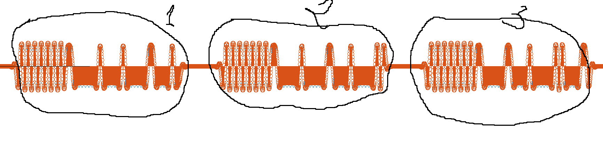
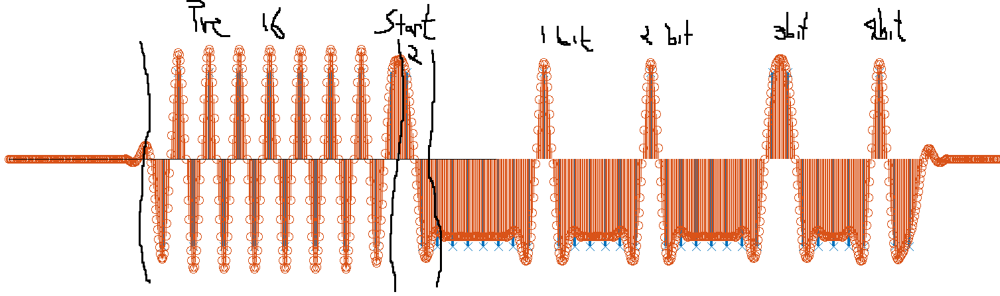
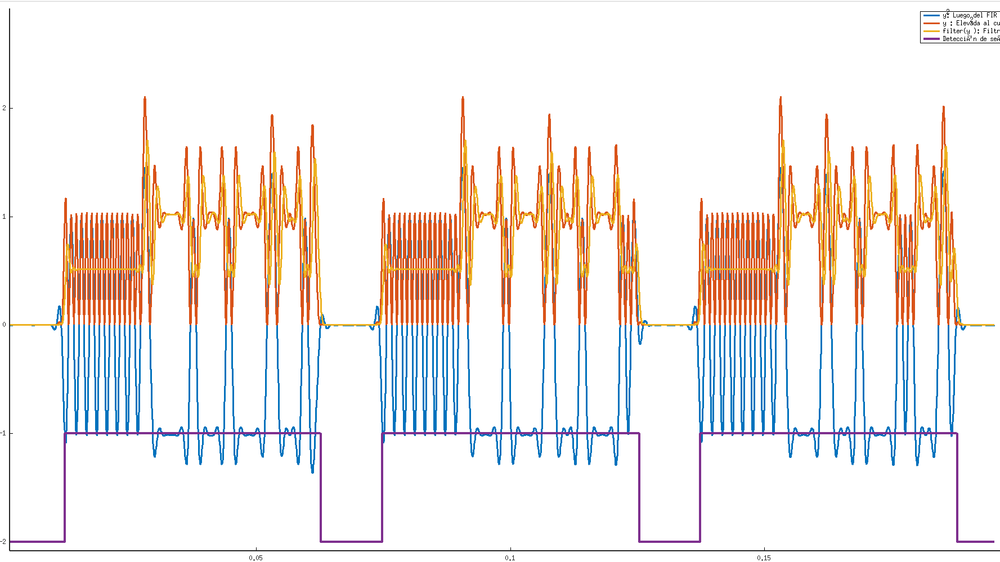
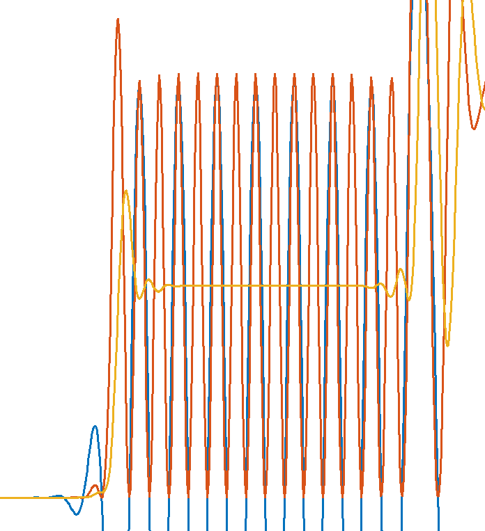

En la siguiente imagen se observan tres transmisiones simuladas con la herramienta octave, se observan tres transmisiones.

En la siguiente imagen se explican cada uno de los bits de una transmisión. Se pueden observar 16 bits de preabulo que varian entre 1 y 0, 2 bits de frama delimiter y 4 bits de datos.
Se puede observar que las deltas no coinciden con la señal.

En la siguiente imagen se puede observa que la señal violeta indica cuando hay un señal y cuando usando como método la potencia de la señal.

Haciendo zoom de la señal anterior podemos observar los siguiente:
La señal azul es la señal recibida despues del fir y la naranja es esta señal elevada al cuadrado y la amarilla es la naranja pasado por un filtro pasa bajos.
