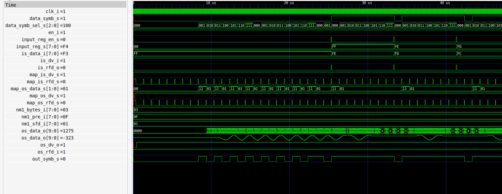

Para completar la simulación, se integró el módulo faltante mediante el siguiente código:

```vhdl
------------------------------------------------------------
-- BEGIN DUT
------------------------------------------------------------
dut : bb_modulator
port map (
    clk_i         => tb_dut_clk_i,
    en_i          => tb_dut_en_i,
    srst_i        => tb_dut_srst_i,
    is_data_i     => tb_dut_is_data_i,
    is_dv_i       => tb_dut_is_dv_i,
    is_rfd_o      => tb_dut_is_rfd_o,
    os_data_o     => tb_dut_os_data_o,
    os_dv_o       => tb_dut_os_dv_o,
    os_rfd_i      => tb_dut_os_rfd_i,
    nm1_bytes_i   => "00000011",
    nm1_pre_i     => "00001111",
    nm1_sfd_i     => "00000001",
    send_i        => tb_dut_send_i,
    tx_rdy_o      => tb_dut_tx_rdy_o
);
----------------------------------------------------------
-- END DUT
------------------------------------------------------------
```
Luego de insertar este módulo, se procedió a ejecutar el siguiente comando:
```
make tb_bb_modulator
```
El comando generó las siguientes simulaciones

